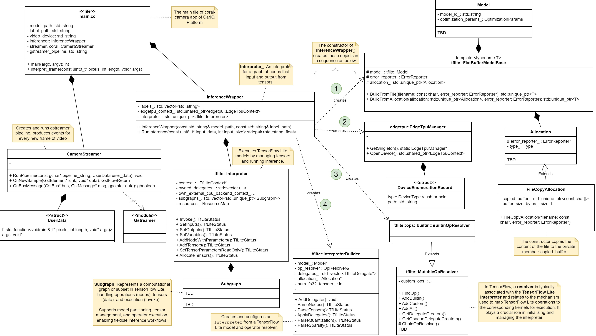
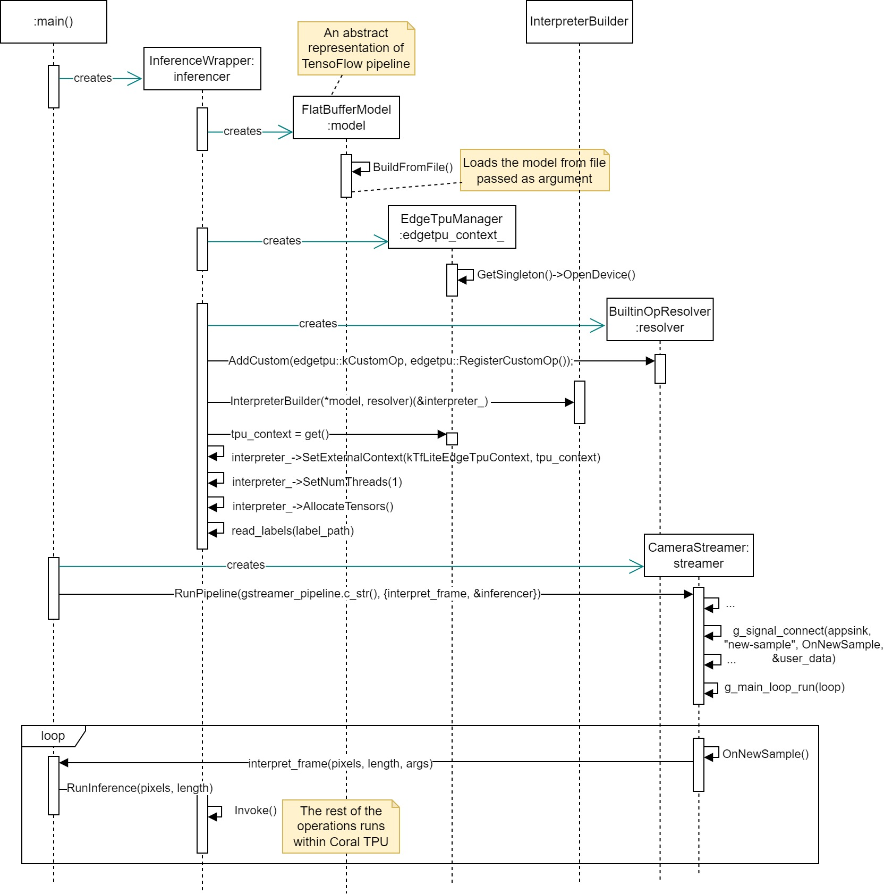

# coral-camera

This app is leveraged from https://github.com/google-coral/examples-camera/tree/master/nativeapp

 

# Architecture
## Structural Views
### Class Diagram: `coral-camera` app's structure

## Behavioural Views
### Sequence Diagram: `coral-camera` app's initialization and execution

